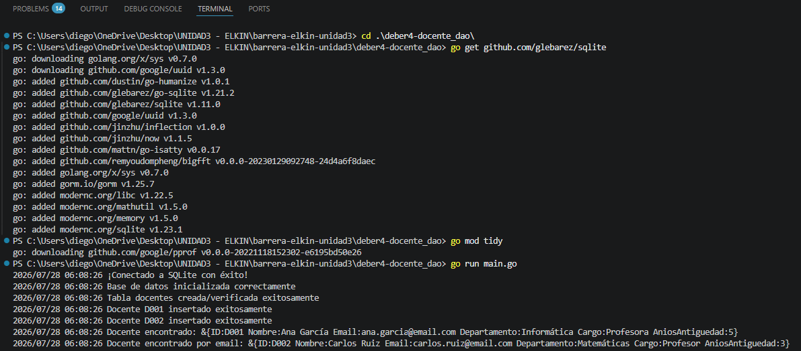

# Deber 4 - DocenteDAO

## Descripción general

Esta actividad implementa el **patrón DAO (Data Access Object)** en Go para
gestionar la persistencia de la entidad `Docente` en una base de datos
relacional SQLite, usando el paquete estándar `database/sql` junto con el
driver `github.com/glebarez/sqlite`.


## ¿Qué es `database/sql`?

`database/sql` es el paquete estándar de Go para trabajar con bases de datos
relacionales. Por sí solo **no sabe hablar con ninguna base de datos
específica**: define una interfaz común (`*sql.DB`, `Exec`, `Query`,
`QueryRow`, etc.) y delega el trabajo real a un **driver**.

En este proyecto, el driver usado es `github.com/glebarez/sqlite`, que
implementa esa interfaz para SQLite. Por eso se importa así en
`dataaccess.go`:

```go
import (
    "database/sql"
    _ "github.com/glebarez/sqlite" // el guion bajo indica "import solo por su efecto secundario"
)
```

```go
sql.Open("sqlite", "docentes.db")
```

## Estructura del proyecto
deber4-docente_dao/
├── dao/
│ └── docente_dao.go 
├── dataaccess/
│ └── dataaccess.go 
├── model/
│ └── docente.go 
├── main.go 
├── go.mod 
├── go.sum
├── competenciasdocentes.db 
└── README.md

### `dataaccess/dataaccess.go`

Contiene la función `InitDB()`, encargada de:

1. Abrir la conexión con `sql.Open("sqlite", "docentes.db")`. Esto **no**
   verifica todavía que la conexión funcione; solo prepara el objeto `*sql.DB`.
2. Verificar la conexión real con `db.Ping()`. Si el archivo no se puede
   crear o abrir, aquí se detecta el error.
3. Devolver el `*sql.DB`, que se reutiliza en toda la aplicación (no se
   abre una conexión nueva por cada operación).

### `model/docente.go`

Define el struct `Docente`, que representa una fila de la tabla
`docentes`. Cada campo del struct corresponde a una columna:

```go
type Docente struct {
    ID              string
    Nombre          string
    Email           string
    Departamento    string
    Cargo           string
    AniosAntiguedad int
}
```

### `dao/docente_dao.go`

Aquí vive toda la lógica de acceso a datos, encapsulada en el tipo
`DocenteDAO`:

```go
type DocenteDAO struct {
    db *sql.DB
}
```

El DAO guarda una referencia a la conexión (`*sql.DB`) para poder ejecutar
consultas cuando se lo pidan. Se construye con `NewDocenteDAO(db)`, que
recibe la conexión ya inicializada desde `main.go`.

Las operaciones implementadas son:

- **`CreateTable()`**: ejecuta un `CREATE TABLE IF NOT EXISTS` con
  `db.Exec()`. Se usa `Exec` (no `Query`) porque la sentencia no devuelve
  filas, solo confirma si se ejecutó correctamente.

- **`Insert(docente *model.Docente)`**: ejecuta un `INSERT INTO` usando
  **parámetros posicionales** (`?`) en lugar de concatenar strings:

```go
  d.db.Exec(query, docente.ID, docente.Nombre, ...)
```

  Esto es importante porque evita **inyección SQL**: los valores se envían
  por separado de la consulta, y el driver se encarga de escaparlos
  correctamente.

- **`GetByID(id string)`** y **`GetByEmail(email string)`**: usan
  `db.QueryRow()` porque se espera **una sola fila** como resultado. El
  resultado se "escanea" campo por campo hacia el struct con `row.Scan(...)`.
  Si no se encuentra ninguna fila, `Scan` devuelve el error especial
  `sql.ErrNoRows`, que se maneja explícitamente para dar un mensaje más
  claro (`"docente con ID %s no encontrado"`) en vez de un error genérico.

### `main.go`

Es el punto de entrada del programa. Su flujo es:

1. Inicializa la base de datos con `dataaccess.InitDB()`.
2. Usa `defer db.Close()` para garantizar que la conexión se cierre al
   terminar el programa, sin importar por dónde salga la función `main`.
3. Crea una instancia del DAO con `dao.NewDocenteDAO(db)`.
4. Llama a `CreateTable()` para asegurar que la tabla exista.
5. Inserta dos docentes de prueba (`Insert`).
6. Busca un docente por `ID` y otro por `Email`, mostrando el resultado
   con `log.Printf`.

## Cómo ejecutar el proyecto

```bash
go mod tidy       # descarga/verifica dependencias (incluye el driver sqlite)
go run main.go
```

Esto crea un archivo `docentes.db` en el directorio del proyecto (si no
existe), crea la tabla `docentes`, inserta los registros de prueba y
muestra las búsquedas por consola.

